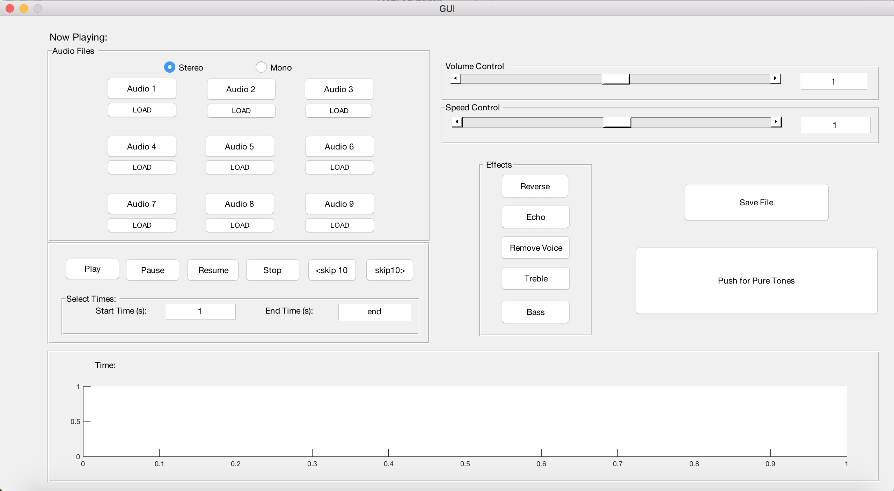
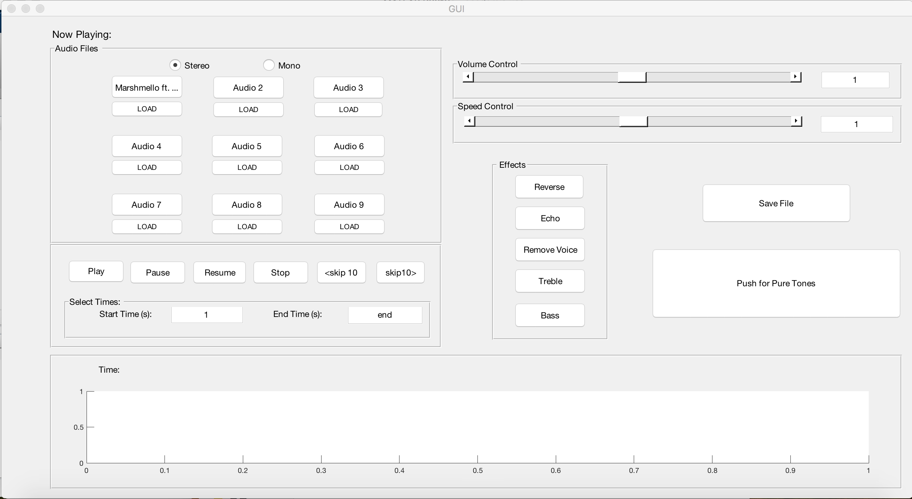
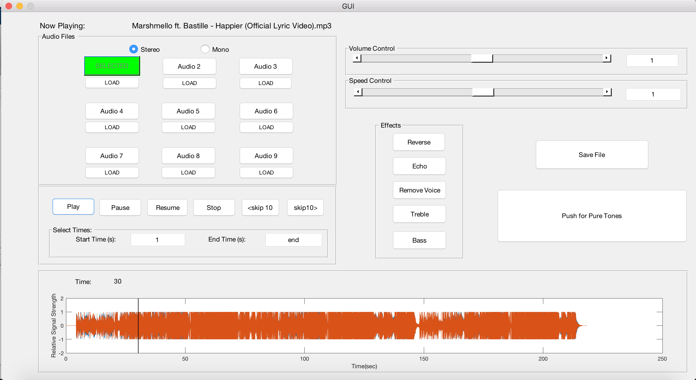
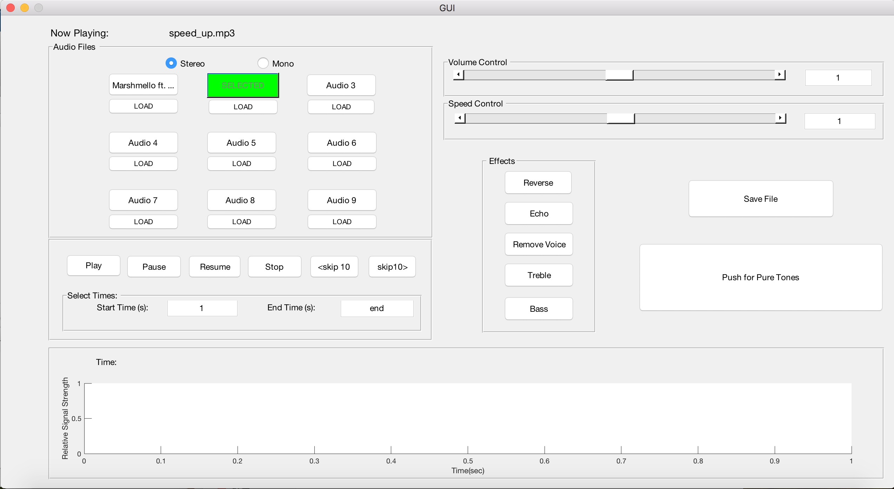
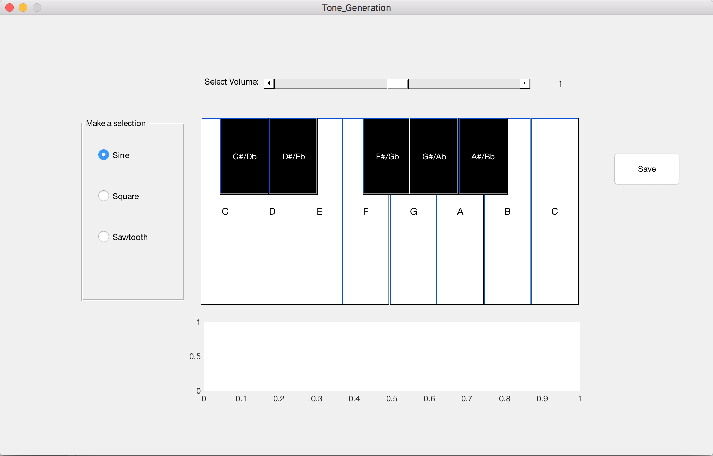

# Audio-File-Editor
This was a group project where three students worked together to utilize MATLAB to create an audio file editor program. The program allows a user to upload any audio file (.mp3, .mp4, .wav, etc.) and edit the file using different effects (speed and volume control, fast forward, rewind, reverse the audio file, echo, remove voice, treble, base, stereo, mono).

The purpose of this project was to have the team learn how to use MATLAB programming to develop a Graphical User Interface (GUI). The team members were also able to learn about editing song files and how software developers work together to create a software product.

# Project Requirements
The basic requirements for this project were:
- 9 buttons to input a song into the UI
- song effects: speed up, speed down, volume up, volume down, fast forward, rewind, reverse, echo, remove voice, treble, base, stereo, and mono
- basic song buttons: play, pause, resume, stop
- a [project report](ProjectReport.pdf) that include instructions on using the editor
- a [youtube video](https://www.youtube.com/watch?v=2plxlYXgQFQ&feature=share) to provide visual instructions on using the editor

Any other features that were implemented were up to the team members. Knowing these requirements, the team members spent time designing the interface look before implementing it.

# Using the Audio File Editor
The interface looks like this:

The user clicks one of the LOAD song buttons to insert a song into the above button. The song name will show up as the new button name.

They can click on the song name to load it, and the PLAY button will play. Note that the below graph will show the song waveform and a tick mark will progress through the graph as the song plays.

The user can then click though the different effects to adjust the audio file, but they have to click PLAY again to have the song continue with the effects.

# Extra Features
The extra features that our team decided to implement were:
- the Audio 1-9 buttons will show the song name that is loaded to the button
- the "Now Playing: (song name)" feature at the top of the interface
- a button to skip 10 seconds back in the song
- a button to skip 10 seconds forward in the song
- a section to allow the user to select the start and end times of the song
- a save song file button (to save an edited song file). Here is an example of a saved song that had the time sped up (file was saved as "speed_up.mp3"). The file was loaded into Audio 2 and can also be selected to play.

- the PUSH FOR PURE TONES button, which opens a second interface:

In this second interface, the user can play any pure tone with the piano image and adjust the sound by making a selection of: Sine, Square, or Sawtooth. As in the original interface, the user can also save their audio file.

# Team Members
Priscilla Chan \
Yan Yi Chen \
Yuqing (Hailey) Huang \
2016 @ UC Davis
